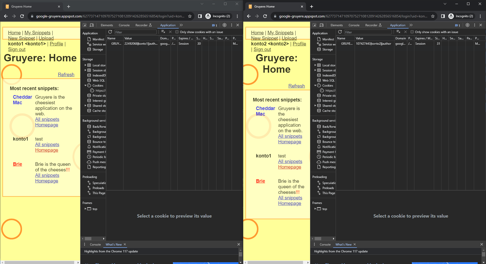

# Kradzież ciasteczek i bezpieczeństwo sesji aplikacji webowych - Zadania Praktyczne

# Zadanie 1

## Cel zadania
Celem tego zadania jest zapoznanie się z mechanizmem przechowywania cookies na stronie internetowej

1. **Przygotowanie Strony:**
   - Otwórz strone internetową https://google-gruyere.appspot.com/start, jest to podatna strona, która będziemy używać do wykonania naszych ćwiczeń. Kliknij agree i start. Warto zaznajomić sie ze stroną, zobaczyć jak działa. Można dodać kilku użytkowników (Nie używaj przy tym własnych haseł i danych bo strona jest dziurawa)

2. **Odczytywanie Cookies:**
   - W zależności od przeglądarki której używasz wejdź w opcje developerskie i znajdź miejsce gdzie przechowywane są ciasteczka strony.

3. **Wyświetlenie Informacji:**
   - Po odszukaniu ciasteczek, wrzuć screen shota na upel i wyjaśnij co oznaczją poszczególne pola.

# Zadanie 2

## Cel zadania
Celem tego zadania jest zdobycie sesji innego użytkownika

1. **Przygotowanie kont**
   - Będziemy potrzebować 2 użytkowników, aby to zrobić należy otworzyć 2 okna przeglądarki i utworzyć 2 konta. Zwrócić uwagę, żeby zrobić je na tej samej sesji gruyere.
   

2. **Odczytywanie Cookies:**
   - W zależności od przeglądarki której używasz wejdź w opcje developerskie i znajdź miejsce gdzie przechowywane są ciasteczka strony.

3. **Wyświetlenie Informacji:**
   - Po odszukaniu ciasteczek, wrzuć screen shota na upel i wyjaśnij co oznaczją poszczególne pola.

