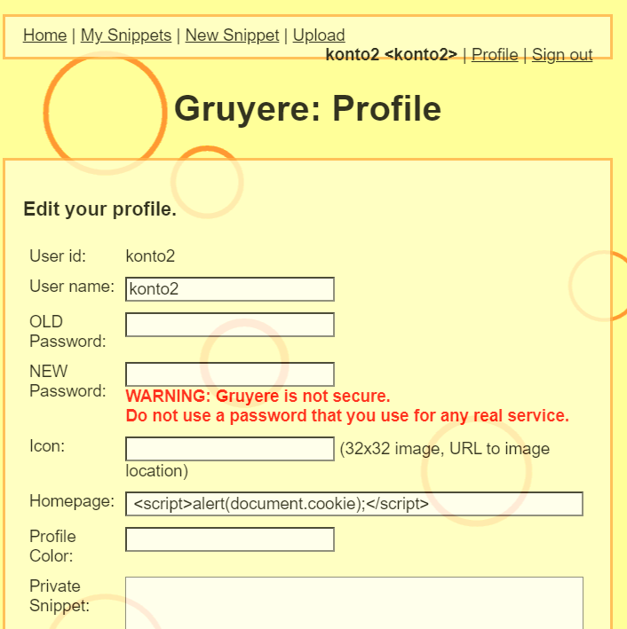

# Kradzież ciasteczek i bezpieczeństwo sesji aplikacji webowych - Zadania Praktyczne

# Zadanie 1

## Cel zadania
Celem tego zadania jest zapoznanie się z mechanizmem przechowywania cookies na stronie internetowej

1. **Przygotowanie Strony:**
   - Otwórz strone internetową https://google-gruyere.appspot.com/start, jest to podatna strona, która będziemy używać do wykonania naszych ćwiczeń. Kliknij agree i start. Warto zaznajomić sie ze stroną, zobaczyć jak działa. Można dodać kilku użytkowników (Nie używaj przy tym własnych haseł i danych bo strona jest dziurawa)

2. **Odczytywanie Cookies:**
   - W zależności od przeglądarki której używasz wejdź w opcje developerskie i znajdź miejsce gdzie przechowywane są ciasteczka strony.

3. **Wyświetlenie Informacji:**
   - Po odszukaniu ciasteczek, wrzuć screen shota na upel i wyjaśnij co oznaczją poszczególne pola.

# Zadanie 2

## Cel zadania
Celem tego zadania jest zdobycie sesji innego użytkownika

1. **Przygotowanie kont:**
   - Będziemy potrzebować 2 użytkowników, aby to zrobić należy otworzyć 2 okna przeglądarki i utworzyć 2 konta. Zwrócić uwagę, żeby zrobić je na tej samej sesji gruyere.

   

2. **Atak XSS:**
   - Następnie napiszemy prosty skrypt js, który pozwoli nam na odczytanie cookiesów. Napisz skrypt, który wypisze w alercie twoje cookiesy.
Można to zrobić w kilku miejscach na tej stronie np. w polu Homepage w ustawieniach profilu. 

Teraz gdy dodamy nowy wpis, a następnie klikniemy przycisk Homepage przy naszym wpisie, przeniesie to nas na link, który wykona nasz wcześniej napisany skrypt.

3. **Zdobycie sesji:**
   - Teraz możemy podmienić wartość cookiesa drugiego konta wartością konta pierwszego. Skopiujemy to co dostaliśmy po znaku równa się w allercie i w opcjach cookiesa podmienimy wartość na drugim koncie.

   

   Przejdź do zakładki Home i zobacz czy zalogowany użytkownik się zmienił.

   Jak już sie pewnie domyślacie atakujący nie będzie miał możliwości skopiowania z jednego okna do drugiego. Normalnie skrypt fetchowałby te cookiesy do jego własnego serera, gdzie mógłby odczytać wartość a następnie przejąć sesje. Ponieważ nie każdy z nas posiada własny serwer zostaniemy na kopiowaniu. Chętni mogą spróbować zmodyfikowac tak skrypt, aby otrzymać ciasteczko czy to przez własny serwer czy wykorzystując słabości strony i zmuszenia użytkownika to udostęnienia swojego cookiesa w snippecie.

